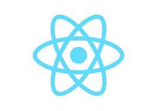

# Hey there I am [Naa-pr](https://github.com/Naa-pr/)..
**I am a student and developer..I feel happy to learn new things..I am a full stack web developer and a cross platform developer..I can make android,ios,web,windows,macos,linux (etc) apps.**
**I have learnt many programing languages and frameworks**
## Programing languages that I learnt
[Python](https://www.python.org/) 
[Node js](https://nodejs.org/en/) and Javascript **For web dev and mobile dev**
HTML CSS SASS SQL
[php](https://www.php.net/) **For backend**
[C++](https://isocpp.org/) 
and a little bit [C#](https://docs.microsoft.com/en-us/dotnet/csharp/)

## Frameworks 
[React](https://reactjs.org/) **For fronend**
[React Native](https://reactnative.dev/) along with [Expo](https://expo.dev/) **For cross platform mobile**
[Electronjs](https://www.electronjs.org/)
[Bootstrap](https://getbootstrap.com/) etc

## Database
MySQL
## Other tools
[Git and Github](https://github.com/)

#### Prefered editor
Visual Studio Code

### Future plan
I would like to improve the knowledge what I have learned..Besides I have plan for learning machine learning,Game ,Augmented Reality and Virtual Reaity and many more

## Language and tools

